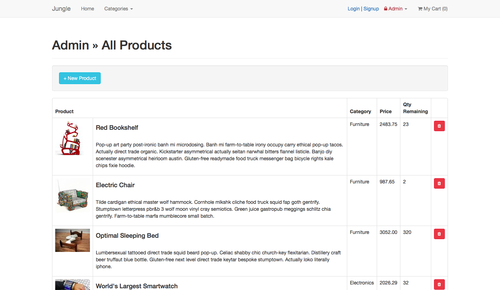
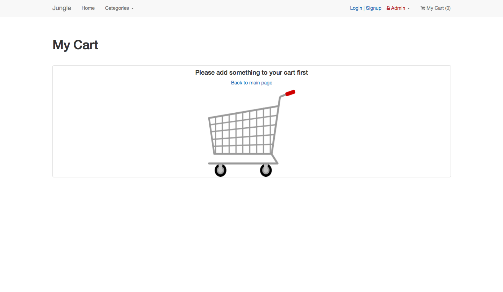
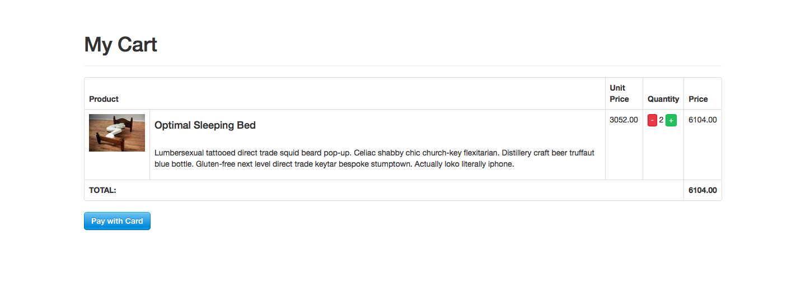
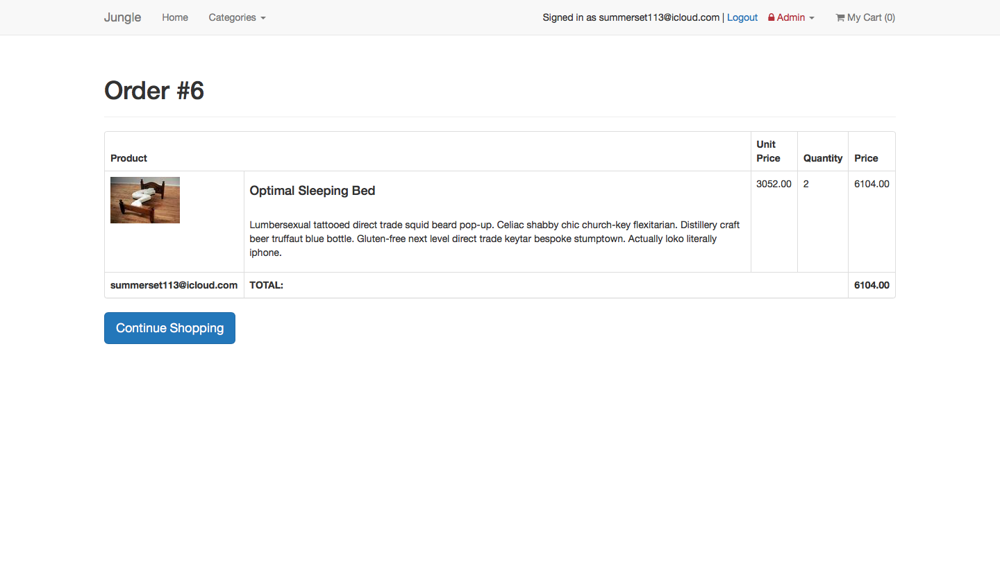

# Jungle

A mini e-commerce application built with Rails 4.2

## Project Overview


```
Index Page with all the products.
```



```
Cart with no items in it
```



```
Cart allowing users to edit their order (increase, decrease or remove items).
```



```
Order confirmation page is displayed to the user once "Submit Order" button is pressed,
and payment is processed.
```

## Setup

1. Run `bundle install` to install dependencies
2. Create `config/database.yml` by copying `config/database.example.yml`
3. Create `config/secrets.yml` by copying `config/secrets.example.yml`
4. Run `bin/rake db:reset` to create, load and seed db
5. Create .env file based on .env.example
6. Put Admin and Email credentials you want to use into appropriate .env vars
7. Sign up for a Stripe account
8. Put Stripe (test) keys into appropriate .env vars
9. Run `bin/rails s -b 0.0.0.0` to start the server

## Stripe Testing

Use Credit Card # 4111 1111 1111 1111 for testing success scenarios.

More information in their docs: <https://stripe.com/docs/testing#cards>

## Dependencies

* Rails 4.2 [Rails Guide](http://guides.rubyonrails.org/v4.2/)
* PostgreSQL 9.x
* Stripe
* bcrypt

For full list of dependencies please take a look at Gemfile
